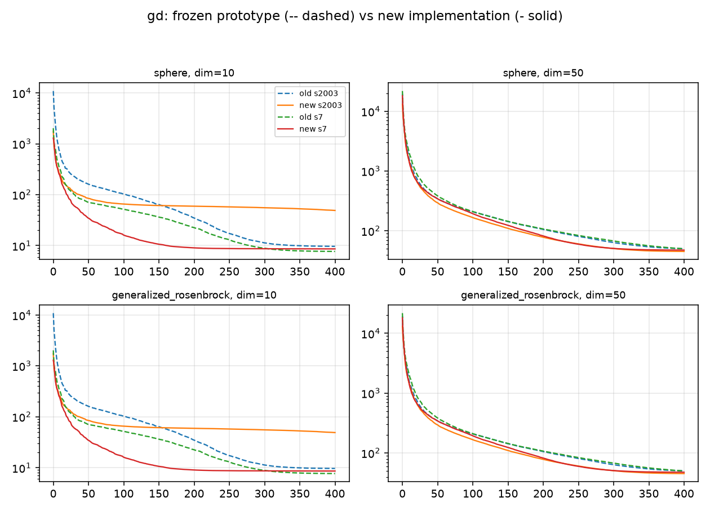
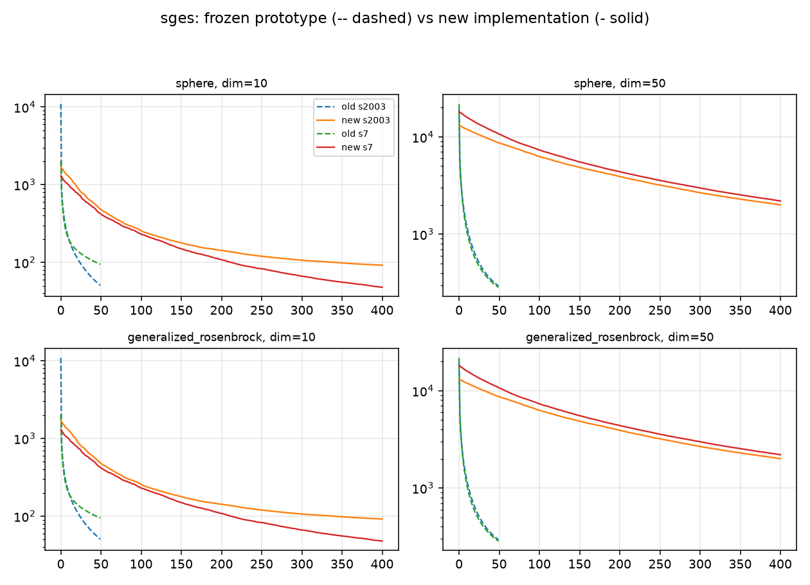
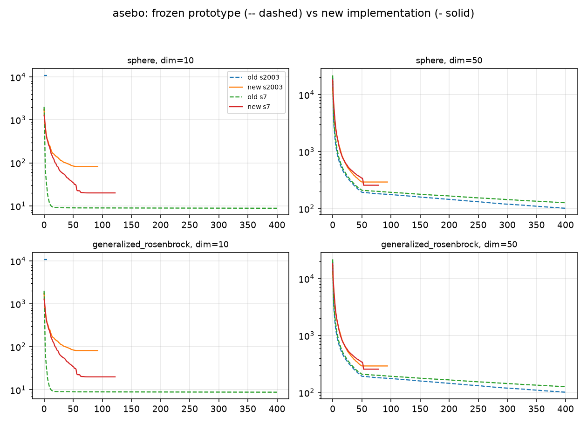
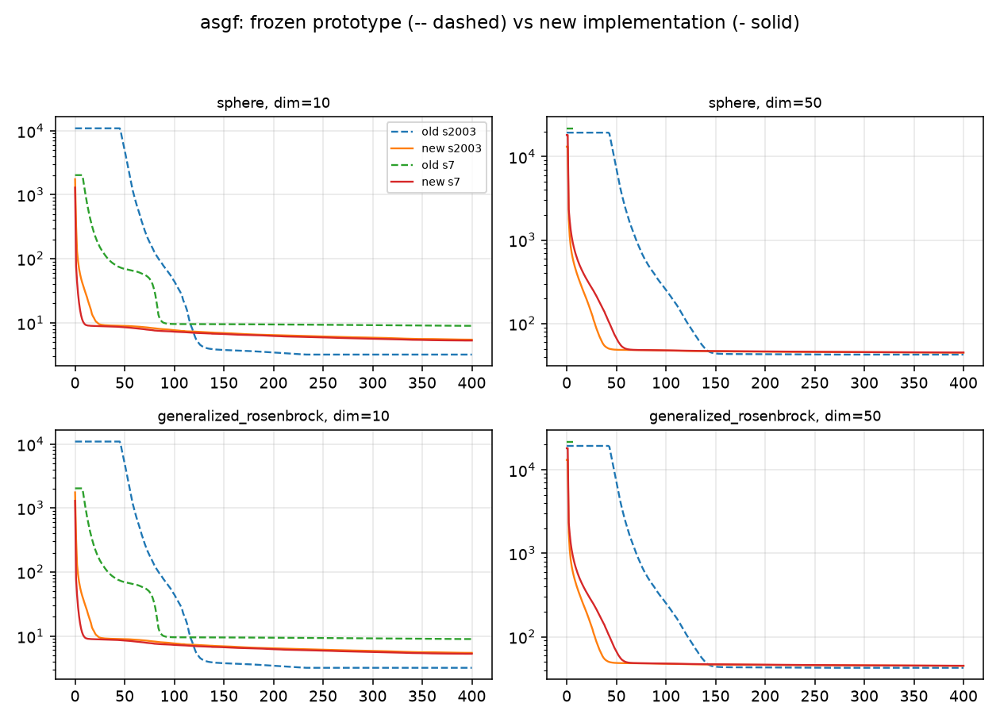
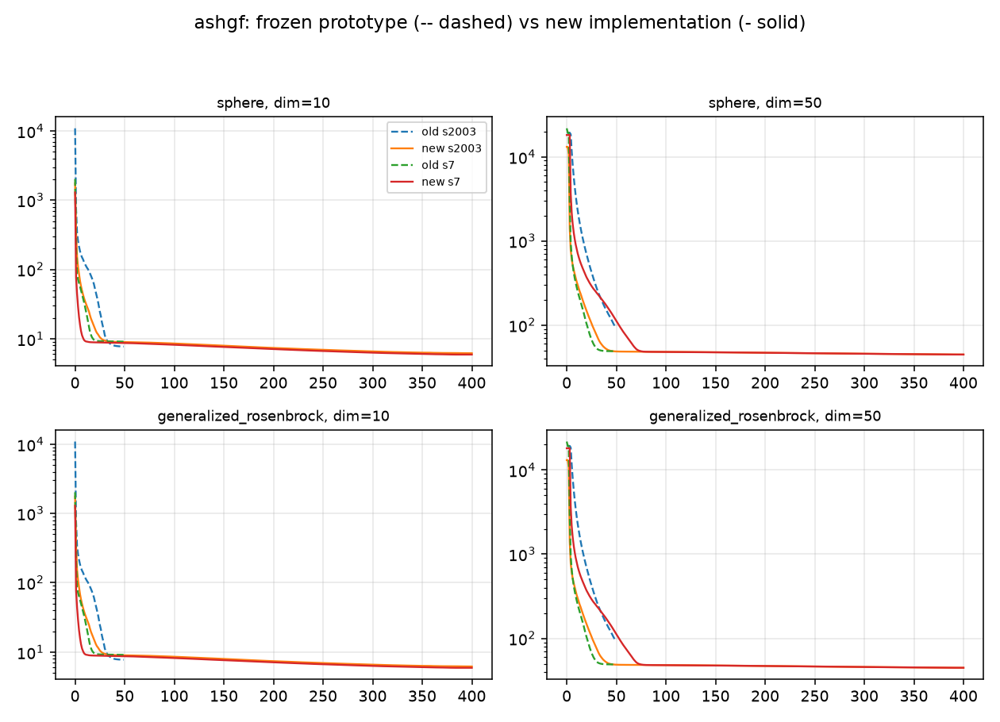

# Old vs New — basics comparison

Grid: functions `sphere`, `generalized_rosenbrock`, dims `[10, 50]`, seeds `[2003, 7]`, `maxiter=400` on both sides.

## Methodology

- **Old side**: the unmodified modules in `original_python_code/` are driven by
  `ashgf.parity.run_original`, which counts objective calls by wrapping
  `Function.evaluate` and reconstructs the full iterate sequence (the prototype's
  returned list always drops the final iterate).
- **New side**: `src/ashgf` algorithms with thesis-default hyperparameters.
- Random streams differ between the two implementations (legacy MT19937 via
  `np.random.seed` vs PCG64 generators), so same-seed curves are a qualitative
  convergence comparison, not a trajectory parity check. Exact-stream parity for GD
  is covered separately in `tests/test_parity.py`.

## Results

| algorithm | function | dim | seed | side | iterations | best value | FEs | wall time (ms) | terminated |
|---|---|---|---|---|---|---|---|---|---|
| gd | sphere | 10 | 2003 | new | 400 | 8.17137 | 8401 | 11 | yes |
| gd | sphere | 10 | 2003 | old | 400 | 15.827 | 8401 | 26 | yes |
| gd | sphere | 10 | 7 | new | 400 | 3.91161 | 8401 | 7 | yes |
| gd | sphere | 10 | 7 | old | 400 | 7.10403 | 8401 | 18 | yes |
| gd | sphere | 50 | 2003 | new | 400 | 37.6392 | 40401 | 18 | yes |
| gd | sphere | 50 | 2003 | old | 400 | 42.4161 | 40401 | 93 | yes |
| gd | sphere | 50 | 7 | new | 400 | 36.9873 | 40401 | 18 | yes |
| gd | sphere | 50 | 7 | old | 400 | 50.5081 | 40401 | 93 | yes |
| gd | generalized_rosenbrock | 10 | 2003 | new | 400 | 49.0165 | 8401 | 12 | yes |
| gd | generalized_rosenbrock | 10 | 2003 | old | 400 | 9.64733 | 8401 | 43 | yes |
| gd | generalized_rosenbrock | 10 | 7 | new | 400 | 8.59971 | 8401 | 11 | yes |
| gd | generalized_rosenbrock | 10 | 7 | old | 400 | 7.6673 | 8401 | 43 | yes |
| gd | generalized_rosenbrock | 50 | 2003 | new | 400 | 45.4056 | 40401 | 25 | yes |
| gd | generalized_rosenbrock | 50 | 2003 | old | 400 | 50.3555 | 40401 | 215 | yes |
| gd | generalized_rosenbrock | 50 | 7 | new | 400 | 47.7434 | 40401 | 25 | yes |
| gd | generalized_rosenbrock | 50 | 7 | old | 400 | 50.3368 | 40401 | 214 | yes |
| sges | sphere | 10 | 2003 | new | 400 | 9.41903 | 8401 | 32 | yes |
| sges | sphere | 10 | 2003 | old | 49 | 17.6882 | 1030 | 3 | **no** |
| sges | sphere | 10 | 7 | new | 400 | 4.50003 | 8401 | 32 | yes |
| sges | sphere | 10 | 7 | old | 49 | 8.03128 | 1030 | 2 | **no** |
| sges | sphere | 50 | 2003 | new | 400 | 43.9012 | 40401 | 192 | yes |
| sges | sphere | 50 | 2003 | old | 49 | 47.8885 | 4950 | 21 | **no** |
| sges | sphere | 50 | 7 | new | 400 | 43.3066 | 40401 | 199 | yes |
| sges | sphere | 50 | 7 | old | 49 | 56.5382 | 4950 | 21 | **no** |
| sges | generalized_rosenbrock | 10 | 2003 | new | 400 | 92.0768 | 8401 | 55 | yes |
| sges | generalized_rosenbrock | 10 | 2003 | old | 49 | 50.7731 | 1030 | 10 | **no** |
| sges | generalized_rosenbrock | 10 | 7 | new | 400 | 47.9223 | 8401 | 44 | yes |
| sges | generalized_rosenbrock | 10 | 7 | old | 49 | 94.5942 | 1030 | 5 | **no** |
| sges | generalized_rosenbrock | 50 | 2003 | new | 400 | 2001.02 | 40401 | 211 | yes |
| sges | generalized_rosenbrock | 50 | 2003 | old | 49 | 294.208 | 4950 | 49 | **no** |
| sges | generalized_rosenbrock | 50 | 7 | new | 400 | 2195.91 | 40401 | 207 | yes |
| sges | generalized_rosenbrock | 50 | 7 | old | 49 | 285.293 | 4950 | 49 | **no** |
| asebo | sphere | 10 | 2003 | new | 400 | 8.75689 | 2101 | 39 | yes |
| asebo | sphere | 10 | 2003 | old | 400 | 13.2104 | 17401 | 157 | yes |
| asebo | sphere | 10 | 7 | new | 400 | 2.2198 | 2101 | 28 | yes |
| asebo | sphere | 10 | 7 | old | 400 | 5.91897 | 17401 | 149 | yes |
| asebo | sphere | 50 | 2003 | new | 400 | 42.313 | 6101 | 167 | yes |
| asebo | sphere | 50 | 2003 | old | 400 | 46.4918 | 17401 | 579 | yes |
| asebo | sphere | 50 | 7 | new | 400 | 18.814 | 6101 | 274 | yes |
| asebo | sphere | 50 | 7 | old | 400 | 55.5123 | 17401 | 585 | yes |
| asebo | generalized_rosenbrock | 10 | 2003 | new | 92 | 81.7323 | 1177 | 8 | yes |
| asebo | generalized_rosenbrock | 10 | 2003 | old | 5 | 10895.2 | 1006 | 11 | yes |
| asebo | generalized_rosenbrock | 10 | 7 | new | 122 | 19.9554 | 1267 | 12 | yes |
| asebo | generalized_rosenbrock | 10 | 7 | old | 400 | 8.77739 | 17401 | 232 | yes |
| asebo | generalized_rosenbrock | 50 | 2003 | new | 94 | 293.926 | 5183 | 25 | yes |
| asebo | generalized_rosenbrock | 50 | 2003 | old | 400 | 102.078 | 17401 | 643 | yes |
| asebo | generalized_rosenbrock | 50 | 7 | new | 79 | 258.072 | 5138 | 120 | yes |
| asebo | generalized_rosenbrock | 50 | 7 | old | 400 | 127.317 | 17401 | 624 | yes |
| asgf | sphere | 10 | 2003 | new | 48 | 8.28894e-15 | 1969 | 12 | yes |
| asgf | sphere | 10 | 2003 | old | 66 | 1.37013e-18 | 2707 | 28 | yes |
| asgf | sphere | 10 | 7 | new | 43 | 6.21849e-15 | 1764 | 10 | yes |
| asgf | sphere | 10 | 7 | old | 18 | 4.43279e-16 | 739 | 8 | yes |
| asgf | sphere | 50 | 2003 | new | 55 | 1.09596e-17 | 11056 | 112 | yes |
| asgf | sphere | 50 | 2003 | old | 68 | 4.23028e-18 | 13669 | 110 | yes |
| asgf | sphere | 50 | 7 | new | 56 | 3.84905e-18 | 11257 | 140 | yes |
| asgf | sphere | 50 | 7 | old | 22 | 6.57103e-16 | 4423 | 36 | yes |
| asgf | generalized_rosenbrock | 10 | 2003 | new | 400 | 5.43783 | 16401 | 98 | yes |
| asgf | generalized_rosenbrock | 10 | 2003 | old | 400 | 3.17748 | 16401 | 153 | yes |
| asgf | generalized_rosenbrock | 10 | 7 | new | 400 | 5.26712 | 16401 | 57 | yes |
| asgf | generalized_rosenbrock | 10 | 7 | old | 400 | 8.93994 | 16401 | 158 | yes |
| asgf | generalized_rosenbrock | 50 | 2003 | new | 400 | 44.9522 | 80401 | 662 | yes |
| asgf | generalized_rosenbrock | 50 | 2003 | old | 400 | 42.6096 | 80401 | 1147 | yes |
| asgf | generalized_rosenbrock | 50 | 7 | new | 400 | 45.1203 | 80401 | 713 | yes |
| asgf | generalized_rosenbrock | 50 | 7 | old | 6 | 21719.8 | 1408 | 19 | **no** |
| ashgf | sphere | 10 | 2003 | new | 38 | 4.25185e-15 | 1559 | 5 | yes |
| ashgf | sphere | 10 | 2003 | old | 24 | 5.2695e-16 | 985 | 11 | yes |
| ashgf | sphere | 10 | 7 | new | 37 | 4.65441e-15 | 1518 | 4 | yes |
| ashgf | sphere | 10 | 7 | old | 17 | 2.19385e-16 | 698 | 8 | yes |
| ashgf | sphere | 50 | 2003 | new | 35 | 3.81752e-15 | 7036 | 8 | yes |
| ashgf | sphere | 50 | 2003 | old | 21 | 5.99216e-16 | 4222 | 36 | yes |
| ashgf | sphere | 50 | 7 | new | 45 | 8.02119e-15 | 9046 | 10 | yes |
| ashgf | sphere | 50 | 7 | old | 19 | 4.00507e-16 | 3820 | 27 | yes |
| ashgf | generalized_rosenbrock | 10 | 2003 | new | 400 | 6.19047 | 16401 | 76 | yes |
| ashgf | generalized_rosenbrock | 10 | 2003 | old | 49 | 7.73388 | 2051 | 19 | **no** |
| ashgf | generalized_rosenbrock | 10 | 7 | new | 400 | 5.92175 | 16401 | 74 | yes |
| ashgf | generalized_rosenbrock | 10 | 7 | old | 49 | 9.10239 | 2051 | 19 | **no** |
| ashgf | generalized_rosenbrock | 50 | 2003 | new | 400 | 44.8375 | 80401 | 1295 | yes |
| ashgf | generalized_rosenbrock | 50 | 2003 | old | 49 | 94.5635 | 10051 | 126 | **no** |
| ashgf | generalized_rosenbrock | 50 | 7 | new | 400 | 44.8971 | 80401 | 1297 | yes |
| ashgf | generalized_rosenbrock | 50 | 7 | old | 49 | 49.1918 | 10051 | 125 | **no** |

Wall-time totals mix early terminations of the frozen prototype, so the fair
throughput comparison is cost per unit work:

| algorithm | function | dim | old ms / 1k FEs | new ms / 1k FEs | throughput gain (old/new) |
|---|---|---|---|---|---|
| gd | sphere | 10 | 2.6 | 1.1 | 2.5x |
| gd | sphere | 50 | 2.3 | 0.4 | 5.2x |
| gd | generalized_rosenbrock | 10 | 5.1 | 1.3 | 3.8x |
| gd | generalized_rosenbrock | 50 | 5.3 | 0.6 | 8.5x |
| sges | sphere | 10 | 2.5 | 3.8 | 0.7x |
| sges | sphere | 50 | 4.2 | 4.8 | 0.9x |
| sges | generalized_rosenbrock | 10 | 7.6 | 5.9 | 1.3x |
| sges | generalized_rosenbrock | 50 | 9.9 | 5.2 | 1.9x |
| asebo | sphere | 10 | 8.8 | 16.0 | 0.5x |
| asebo | sphere | 50 | 33.4 | 36.1 | 0.9x |
| asebo | generalized_rosenbrock | 10 | 13.2 | 8.2 | 1.6x |
| asebo | generalized_rosenbrock | 50 | 36.4 | 14.0 | 2.6x |
| asgf | sphere | 10 | 10.4 | 5.9 | 1.8x |
| asgf | sphere | 50 | 8.1 | 11.3 | 0.7x |
| asgf | generalized_rosenbrock | 10 | 9.5 | 4.7 | 2.0x |
| asgf | generalized_rosenbrock | 50 | 14.3 | 8.6 | 1.7x |
| ashgf | sphere | 10 | 11.2 | 2.9 | 3.9x |
| ashgf | sphere | 50 | 7.9 | 1.2 | 6.8x |
| ashgf | generalized_rosenbrock | 10 | 9.2 | 4.5 | 2.0x |
| ashgf | generalized_rosenbrock | 50 | 12.5 | 16.1 | 0.8x |

## Documented deviations observed in this run

- **NumPy >= 2 incompatibility in the guidance machinery.** The helper `compute_directions_sges` (shared by `sges.py` and `ashgf.py`) calls `int(np.random.choice(...))`, which raises under NumPy >= 2. The frozen SGES (8 runs) and ASHF (4 Rosenbrock runs) therefore abort at their first guided/historical iteration (i = t); on sphere they simply converge during the plain warm-up phase instead.
  Even under the legacy environment where that call succeeded, freshly drawn random directions overwrite the guided ones inside `grad_estimator`, so self-guidance never takes effect; moreover SGES re-seeds the global RNG at every estimator call, so its warm-up iterations reuse the identical direction matrix.
- **Silent failures.** Bare `except Exception` handlers print 'Something has gone wrong!' and stop without surfacing the error. Observed here: asgf (generalized_rosenbrock, d=50, seed=7). In the ASGF case the trajectory diverged on Rosenbrock until inf/NaN values made `scipy.linalg.orth` raise a ValueError that was swallowed.
- **Silent false convergence.** asebo (generalized_rosenbrock, d=10, seed=2003): the trajectory diverged until values reached O(1e78); at that scale the +/- sigma*xi perturbations round away (x + sigma*xi == x - sigma*xi exactly), the estimated gradient becomes exactly zero, and the eps criterion declares convergence after a handful of iterations with best value equal to the initial one — no error is reported.
- Frozen **ASEBO warm-up samples 100 directions regardless of dimension** (thesis: n_t = d during the l warm-up iterations); at dim=10 it spent on average 8.0x more evaluations than the canonical implementation, and its total FE budget per run is dimension-independent because the fixed 100-direction sampling dominates both dims.
- Frozen **ASGF/ASHF Gauss-Hermite rule** uses offset sigma*p_k and prefactor 2/(sigma*sqrt(pi)) instead of the thesis sqrt(2)*sigma*p_k and sqrt(2)/(sqrt(pi)*sigma) (O(sigma)-biased legacy estimator; reproducible via `legacy_rule=True`).
- Prototype returns drop the final iterate's value (off-by-one), expose no FE counter, re-seed the global RNG inside estimators, and keep mutable class-level state in ASGF/ASHF.

## Figures

